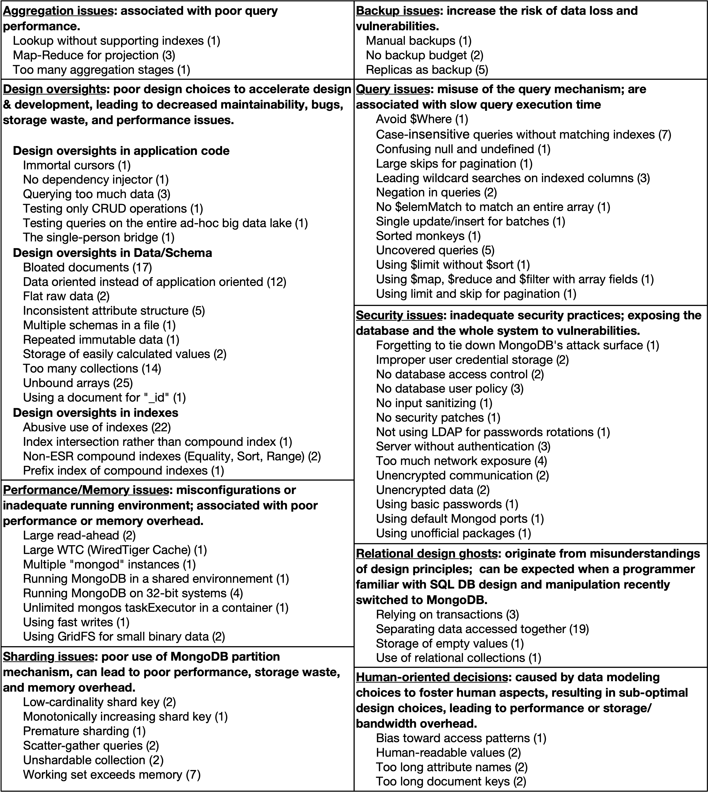

# Identifying MongoDB Code Smells

Online appendix of the paper "Identifying MongoDB Code Smells" submitted to the Research Track of [CAiSE 2023](https://caise23.svit.usj.es/).

# MongoDB Smell Catalog

Material for RQ1, "What types of MongoDB smells have been proposed in the community?"

 - [Final classification](Catalog/classification.csv)
 - [Sources included](Catalog/sources_kept.csv) -- (with "Sx" IDs, as referenced in the paper)
 - [Sources excluded](Catalog/sources_excluded.csv)
 
 

# Case Study of Relational Design Ghosts

Source code of the static analysis and results on open-source JavaScript projects.

 - [CodeQL queries](CodeQL_queries/readme.md)
 - [Studied projects](CaseStudy/projects_stats.csv)
 - [Detected smell instances](CaseStudy/smells.csv)
 - [Notebook with the results](CaseStudy/Analysis.ipynb)
 
